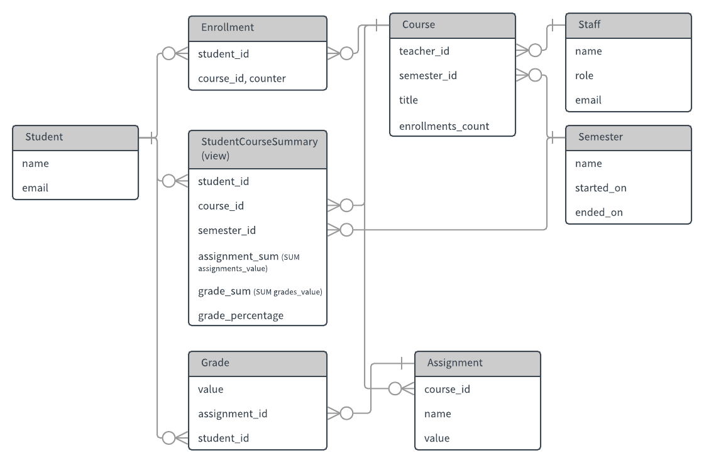

# Exgradebook

## Getting Started

After you have cloned this repo, run this setup script to set up your machine
with the necessary dependencies to run and test this app:

    % ./bin/setup

It assumes you have a machine equipped with Elixir and [postgres]. If
you have [asdf], then it will try to install the correct versions with
[asdf-elixir], [asdf-erlang], and [asdf-nodejs].

After setting up, you can run the application:

    % ./bin/server

[asdf]: https://github.com/asdf-vm/asdf
[asdf-elixir]: https://github.com/asdf-vm/asdf-elixir
[asdf-erlang]: https://github.com/asdf-vm/asdf-erlang
[asdf-nodejs]: https://github.com/asdf-vm/asdf-nodejs
[postgres]: http://postgresapp.com/

## Testing

    % ./bin/test_suite
    # or
    % mix test

The `bin/test_suite` script will also enforce no compiler warnings, so
that is better to use.

## Deployment

It's [deployed at heroku at https://exgradebook-production.herokuapp.com][url]

Once added to the heroku app, you can also deploy:

    % ./bin/deploy production

[url]: https://exgradebook-production.herokuapp.com/

## Requirements

- [x] A Teacher can manage his course roster
- [x] A Teacher can view the enrolled students and their grades for a given course
- [x] A Student can see the courses he is registered for (with grades)
- [x] A Student can see his GPA for a given semester
- [x] An Administrator can view enrollment counts across all courses for a semester (performance is a concern)
- [x] An Administrator can view an average grade for a given course (performance is a concern)

## ERD

## Screenshots

[screenshots.md](docs/screenshots.md)

## Things that could be improved

- Pagination. I didn't use it anywhere
- Tests. I slowed down on writing them when I was implementing the last
    couple of controllers. There are still 100+ tests.
- No e2e tests.
- No typespecs
- No doctests
- No comments
- I tried an idea with grouping queries and then importing them into the
    context file. I don't like this idea anymore because it requires
    them to be `quote`'d into the context, and also hides where the app
    crashes are occurring, and also not as friendly error messages. I'd
    do it differently next time.
- Assignments and Grades can only be seeded. There's no way to manage
    them in the UI.
- I made some decisions knowing this won't be used in the real world.
- Some of the grade calculation could be offloaded to the database; but
    after wrastlin' with the [StudentCourseSummary] database view I didn't
    think it was worth improving it _everywhere_. The database view
    handles the worst of the calculations.
- Probably app styling.
- The seeded data is pretty boring. It doesn't even use Faker.
- There's almost no JavaScript (some would say that's a good thing)
- There's barely any custom styling (Thanks Bootstrap4)
- I didn't even try to look at it on my phone, so I'm sure it's not
    mobile-optimized.
- I never used a `LEFT JOIN LATERAL` before. That was cool, but I
    might have gotten it wrong.

[StudentCourseSummary]: priv/repo/migrations/20180326020858_create_student_course_view.exs
